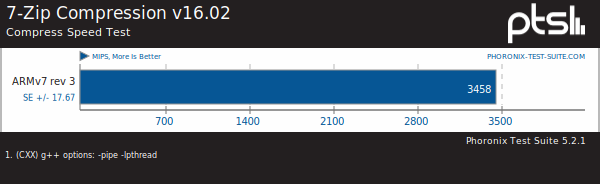
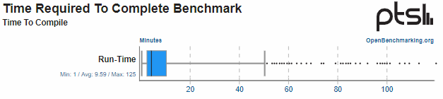

# Performance Report on Raspberry Pi 4 (1GB)
by Andrew Waltos s3791004
## Introduction
This is a report on the performance of the Pi4 1GB model. It intends to outline how the Pi performs during test suites: Compilation, Compression, Memory, and Python. These tests target the Pi's Processor, System, and Memory components.  
The report will discuss test selection and how these tests were run. Then it will look at the results and offer an analysis of how the Pi4 compares to other systems.

## Method
Tests were run through [Phoronix Test Suite] (https://www.phoronix-test-suite.com) \(PTS\) via the CLI on the Pi. PTS is a program that has a collection of test suites and can execute a selection of tests after downloading required files and dependencies.  
The 4 tests mentioned above were selected because they stress test different components of the Pi in ways that the Pi is commonly used. The Compilation test is relevant because a Pi running Linux may undergo many compilation scenarios if a user is tweaking a kernel over and over to achieve a specific desired build. Compression is often used when backing up and restoring. Memory is also an interesting test to compare against similar Pi models that have higher RAM. Python is a commonly used language in developing on a Pi.  
Results can easily be compared to other systems as they are uploaded to [OpenBenchmarking](https://openbenchmarking.org).

## Results

### Compression
[Results on OpenBenchmarking](https://openbenchmarking.org/result/2011201-KH-S3791004390)  
The 7-Zip compression test in this suite returned a score of 3458 MIPS \(Million Instructions Per Second\).  
  
On OpenBenchmarking this sits in the 13th percentile of uploaded tests \(over 8,000 samples\).

### Compilation
[Results on OpenBenchmarking](https://openbenchmarking.org/result/2011211-KH-COMPILATI62)  
One of the tests in the suite is a Timed Linux Kernel Compilation. This tests the time in seconds taken to compile a default Linux kernel. This took around 2,222 seconds \(37 minutes\) to complete and was placed in the 2nd percentile on OpenBenchmarking.

### Memory
[Results on OpenBenchmarking](https://openbenchmarking.org/result/2011212-KH-MEMORYS3796)  
Memory was an interesting suite to carry out as there are a few variants of the Pi4 which offer different amounts of built-in RAM.

### Python
[Results on OpenBenchmarking](https://openbenchmarking.org/result/2011210-KH-PYTHONS3714)  

## Analysis
Overall, the Pi performed as expected being a small, cheap single board computer. When compared to other systems online it performs in the low tier. Although it does perform quite well compared to systems that would have been considered high-end some years ago. In some tests, the Pi performed as well as 3rd Gen Intel processors - Even though these are now around 7 years old, it is impressive how far the Pi has come to achieve these results in its development and considering its size and cost.

## Conclusions
